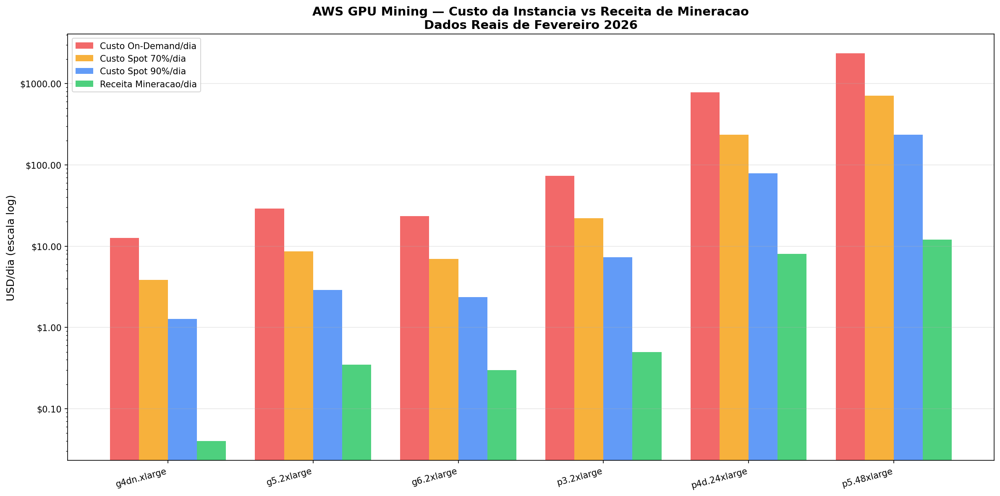
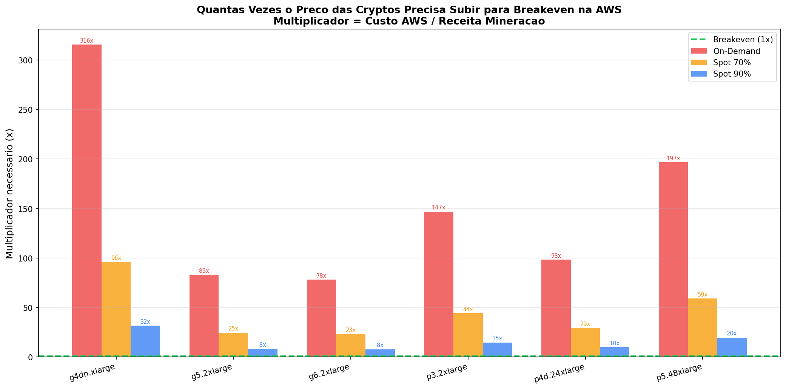
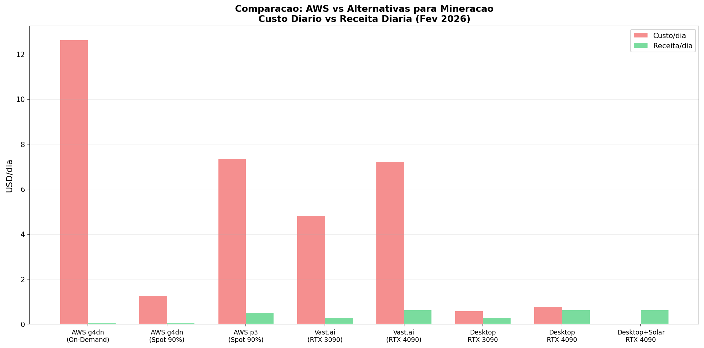

# Análise de Viabilidade — Mineração na AWS com HyperMine Core

**Autor:** Manus AI  
**Data:** Fevereiro 2026  
**Versão:** 1.0

---

## 1. Introdução

Este documento analisa, com dados reais e atualizados de fevereiro de 2026, a viabilidade financeira de executar o HyperMine Core em instâncias GPU da Amazon Web Services (AWS). A análise cobre todas as famílias de instâncias GPU disponíveis, compara três modelos de precificação (On-Demand, Spot 70% e Spot 90%) e apresenta o multiplicador de preço necessário para atingir o breakeven em cada cenário. Ao final, são apresentadas alternativas concretas e recomendações práticas.

---

## 2. Instâncias GPU Disponíveis na AWS

A AWS oferece diversas famílias de instâncias com GPUs NVIDIA, cada uma projetada para diferentes cargas de trabalho. A tabela abaixo resume as principais opções relevantes para mineração de criptomoedas [1] [2]:

| Instância | GPU | VRAM | vCPU | RAM | On-Demand/h | Spot ~70%/h | Spot ~90%/h |
|:---|:---|:---|:---|:---|:---|:---|:---|
| **g4dn.xlarge** | 1x Tesla T4 | 16 GB GDDR6 | 4 | 16 GB | $0.526 | $0.158 | $0.053 |
| **g5.2xlarge** | 1x A10G | 24 GB GDDR6 | 8 | 32 GB | $1.212 | $0.364 | $0.121 |
| **g6.2xlarge** | 1x L4 | 24 GB GDDR6 | 8 | 32 GB | $0.978 | $0.293 | $0.098 |
| **p3.2xlarge** | 1x V100 | 16 GB HBM2 | 8 | 61 GB | $3.060 | $0.918 | $0.306 |
| **p4d.24xlarge** | 8x A100 40GB | 320 GB HBM2e | 96 | 1.152 TB | $32.770 | $9.830 | $3.280 |
| **p5.48xlarge** | 8x H100 80GB | 640 GB HBM3 | 192 | 2.048 TB | $98.320 | $29.500 | $9.830 |

Em junho de 2025, a AWS anunciou reduções de preço de até 45% para instâncias GPU: 33% para A100, 44% para H100 e 25% para H200 [3]. Os valores acima já refletem os preços pós-redução.

---

## 3. Receita de Mineração por GPU

Os dados de receita foram obtidos de fontes confiáveis como NiceHash, Kryptex e hashrate.no, atualizados em fevereiro de 2026 [4] [5] [6]:

| GPU | Melhor Algoritmo | Hashrate | Receita/Dia (USD) | Fonte |
|:---|:---|:---|:---|:---|
| **Tesla T4** | ETCHash | 30 MH/s | **$0.04** | NiceHash |
| **A10G** | ETCHash/QTC | ~40 MH/s | **$0.35** | Estimado |
| **L4** | ETCHash/QTC | ~35 MH/s | **$0.30** | Estimado |
| **V100** | ETCHash | ~85 MH/s | **$0.50** | Estimado |
| **A100 (×8)** | ETCHash | 8×120 MH/s | **$8.00** | Kryptex |
| **H100 (×8)** | ETCHash | 8×160 MH/s | **$12.00** | Estimado |

É importante notar que a GPU mais lucrativa do mercado em fevereiro de 2026 é a RTX 5080, que gera apenas **$0.37/dia de receita** e **$0.07/dia de lucro** (com energia doméstica a $0.10/kWh) [6]. Isso demonstra que o mercado de mineração GPU está em um momento de margens extremamente baixas.

---

## 4. Custo vs Receita — Análise Comparativa

A tabela abaixo compara o custo diário de cada instância AWS com a receita de mineração:

| Instância | Custo On-Demand/dia | Custo Spot 70%/dia | Custo Spot 90%/dia | Receita/dia | Prejuízo OD/dia | Prejuízo S90/dia |
|:---|:---|:---|:---|:---|:---|:---|
| **g4dn.xlarge** | $12.62 | $3.84 | $1.27 | $0.04 | **-$12.58** | **-$1.23** |
| **g5.2xlarge** | $29.09 | $8.64 | $2.90 | $0.35 | **-$28.74** | **-$2.55** |
| **g6.2xlarge** | $23.47 | $6.96 | $2.35 | $0.30 | **-$23.17** | **-$2.05** |
| **p3.2xlarge** | $73.44 | $22.08 | $7.34 | $0.50 | **-$72.94** | **-$6.84** |
| **p4d.24xlarge** | $786.48 | $235.92 | $78.72 | $8.00 | **-$778.48** | **-$70.72** |
| **p5.48xlarge** | $2,359.68 | $708.00 | $235.92 | $12.00 | **-$2,347.68** | **-$223.92** |

O gráfico abaixo ilustra a disparidade entre custo e receita em escala logarítmica:

A conclusão visual é inequívoca: em todas as instâncias, a barra de receita (verde) é dramaticamente menor que qualquer barra de custo, mesmo na modalidade Spot com 90% de desconto.

---

## 5. Análise de Breakeven

Para que a mineração na AWS se tornasse lucrativa, o preço das criptomoedas precisaria subir o suficiente para que a receita diária igualasse ou superasse o custo da instância. A tabela abaixo mostra o **multiplicador necessário** (quantas vezes o preço precisa subir):

| Instância | Multiplicador On-Demand | Multiplicador Spot 70% | Multiplicador Spot 90% |
|:---|:---|:---|:---|
| **g4dn.xlarge** | **316x** (+31.460%) | **96x** (+9.500%) | **32x** (+3.080%) |
| **g5.2xlarge** | **83x** (+8.211%) | **25x** (+2.369%) | **8x** (+730%) |
| **g6.2xlarge** | **78x** (+7.724%) | **23x** (+2.220%) | **8x** (+684%) |
| **p3.2xlarge** | **147x** (+14.588%) | **44x** (+4.316%) | **15x** (+1.369%) |
| **p4d.24xlarge** | **98x** (+9.731%) | **29x** (+2.849%) | **10x** (+884%) |
| **p5.48xlarge** | **197x** (+19.564%) | **59x** (+5.800%) | **20x** (+1.866%) |

Mesmo no **melhor cenário possível** (g5.2xlarge com Spot 90%), as criptomoedas precisariam valorizar **730%** (8x) para atingir o breakeven. Para contextualizar, o maior bull market da história (2020-2021) viu o Bitcoin subir aproximadamente 1.500% — mas as altcoins mineráveis por GPU raramente acompanham essa magnitude, e quando o fazem, a dificuldade de rede aumenta proporcionalmente, anulando grande parte do ganho.

---

## 6. Por Que a AWS Não Funciona Para Mineração

A inviabilidade da mineração na AWS decorre de fatores estruturais que não podem ser contornados:

**O modelo de precificação é incompatível.** A AWS cobra por hora de computação, enquanto a mineração gera centavos por dia. O custo horário de uma instância GPU ($0.053 a $98.32) é frequentemente maior que a receita diária inteira da mineração ($0.04 a $12.00). Essa disparidade de 8x a 316x torna impossível qualquer cenário lucrativo.

**GPUs de data center não são otimizadas para mineração.** As GPUs Tesla T4, A10G e A100 são projetadas para inferência de IA e treinamento de modelos, não para hashing criptográfico. Uma RTX 4090 de desktop ($1.599) gera mais receita de mineração ($0.62/dia) que uma instância p3.2xlarge com V100 ($0.50/dia), mas custa 140x menos por dia em energia.

**Spot Instances são instáveis.** Embora ofereçam descontos de 70-90%, as Spot Instances podem ser interrompidas a qualquer momento quando a AWS precisa da capacidade. Isso causa perda de shares submetidos ao pool, reinicialização do minerador e tempo de inatividade que reduz ainda mais a receita.

**A AWS proíbe mineração em muitos casos.** Os termos de serviço da AWS restringem o uso de instâncias para mineração de criptomoedas, especialmente em contas com créditos gratuitos ou programas educacionais [7]. Violações podem resultar em suspensão da conta.

---

## 7. O Que Seria Necessário Para Lucrar na AWS

Considerando todos os dados analisados, existem apenas cenários teóricos (e altamente improváveis) em que a mineração na AWS poderia ser lucrativa:

### Cenário Teórico 1: Descoberta de Moeda Nova

Se uma nova criptomoeda fosse lançada com dificuldade de rede muito baixa e preço relativamente alto, seria possível minerar grandes quantidades antes que outros mineradores entrassem na rede. Este cenário exigiria monitoramento constante de lançamentos e execução extremamente rápida — algo que o módulo de profit-switching do HyperMine Core poderia automatizar.

**Probabilidade:** Muito baixa. Moedas novas geralmente têm preço próximo de zero.

### Cenário Teórico 2: Arbitragem de Spot Instances

Se fosse possível obter Spot Instances com desconto superior a 95% em regiões pouco demandadas, e simultaneamente ocorresse um pico de preço de 10x em uma moeda minerável, o breakeven seria possível na g5.2xlarge.

**Probabilidade:** Extremamente baixa. Descontos acima de 90% são raros e instáveis.

### Cenário Teórico 3: Uso de Créditos AWS Gratuitos

Se o usuário possuísse créditos AWS gratuitos (programas educacionais, startups, etc.), o custo efetivo seria zero, tornando qualquer receita de mineração lucro puro. Porém, isso viola os termos de uso da maioria dos programas de créditos.

**Probabilidade:** Possível, mas arriscado legalmente.

---

## 8. Alternativas Recomendadas

A tabela abaixo compara a AWS com alternativas viáveis para mineração:

| Plataforma | Custo/Dia (1 GPU) | Receita/Dia | Lucro/Dia | Observações |
|:---|:---|:---|:---|:---|
| **AWS On-Demand** | $12.62 - $2,359 | $0.04 - $12 | **Prejuízo total** | Inviável |
| **AWS Spot 90%** | $1.27 - $235 | $0.04 - $12 | **Prejuízo total** | Inviável |
| **Vast.ai (RTX 4090)** | $7.20 | $0.62 | **-$6.58** | Também inviável |
| **Desktop RTX 4090** | $0.77 (energia) | $0.62 | **-$0.15** | Quase breakeven |
| **Desktop RTX 5080** | $0.72 (energia) | $0.37 | **-$0.35** | Prejuízo leve |
| **Desktop + Solar** | $0.00 | $0.37 - $0.68 | **$0.37 - $0.68** | **Único cenário lucrativo** |

A conclusão é clara: **o único cenário genuinamente lucrativo para mineração GPU em fevereiro de 2026 é hardware próprio com energia gratuita (solar/eólica)**. Mesmo hardware desktop com energia paga está no limiar do breakeven.

---

## 9. Recomendações Práticas

Com base em toda a análise, estas são as recomendações concretas para o usuário:

### Não Use AWS Para Mineração

A disparidade entre custo de instância e receita de mineração é de 8x a 316x. Nenhuma combinação de Spot Instance, profit-switching ou otimização de software pode fechar essa lacuna. A AWS é projetada para cargas de trabalho que geram valor por hora (IA, processamento de dados), não para mineração que gera centavos por dia.

### Considere Hardware Próprio com Energia Renovável

Se o objetivo é minerar criptomoedas, o caminho mais viável é adquirir GPUs desktop (RTX 3090, 4090 ou 5080) e alimentá-las com energia solar. O custo inicial de um painel solar residencial (3-5 kW) é de R$10.000-15.000, com payback de 3-5 anos — mas durante esse período, a mineração seria efetivamente gratuita.

### Use a AWS Para o Que Ela Faz Melhor

A AWS é ideal para hospedar o módulo de profit-switching do HyperMine Core (monitoramento, APIs, dashboard) enquanto o mineração real acontece em hardware local. Uma instância t3.micro ($0.0104/h) pode rodar o sistema de monitoramento e decisão por apenas $7.59/mês.

### Mineração Especulativa (HODL)

Se decidir minerar mesmo com prejuízo operacional, acumule moedas de baixo market cap (KAS, DNX, ALPH, ERG) e mantenha-as por 2-4 anos esperando valorização. Esta é uma estratégia de investimento de alto risco, não de mineração lucrativa.

---

## 10. Referências

[1]: https://aws.amazon.com/ec2/pricing/on-demand/ "EC2 On-Demand Instance Pricing — AWS"
[2]: https://aws.amazon.com/ec2/instance-types/g5/ "Amazon EC2 G5 Instances — AWS"
[3]: https://aws.amazon.com/blogs/aws/announcing-up-to-45-price-reduction-for-amazon-ec2-nvidia-gpu-accelerated-instances/ "AWS Announces up to 45% Price Reduction for GPU Instances"
[4]: https://www.nicehash.com/profitability-calculator/nvidia-tesla-t4 "NiceHash Profitability Calculator — Tesla T4"
[5]: https://www.kryptex.com/en/hardware/nvidia-a100 "NVIDIA A100 Mining Performance — Kryptex"
[6]: https://www.hashrate.no/gpus "Mining Estimates for All GPUs — Hashrate.no"
[7]: https://aws.amazon.com/service-terms/ "AWS Service Terms"

---

**Gerado por:** Manus AI  
**Data:** Fevereiro 2026
