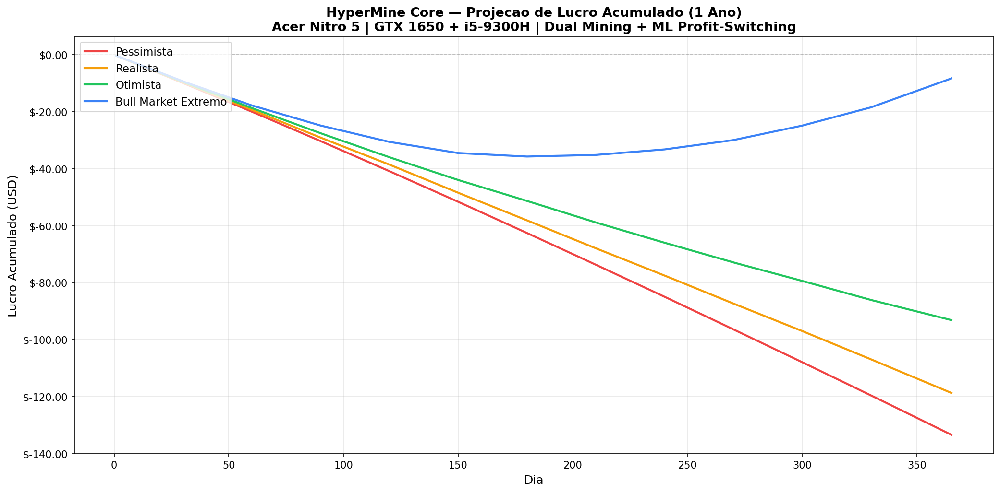
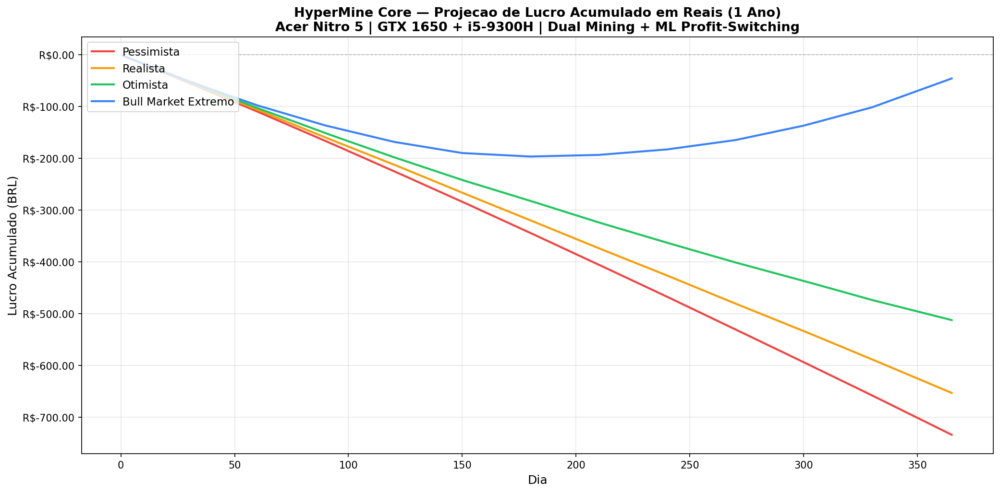
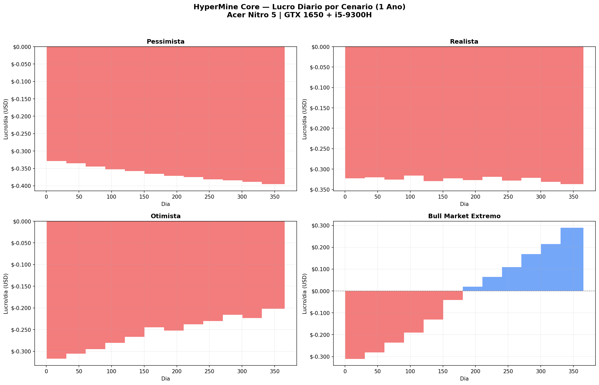
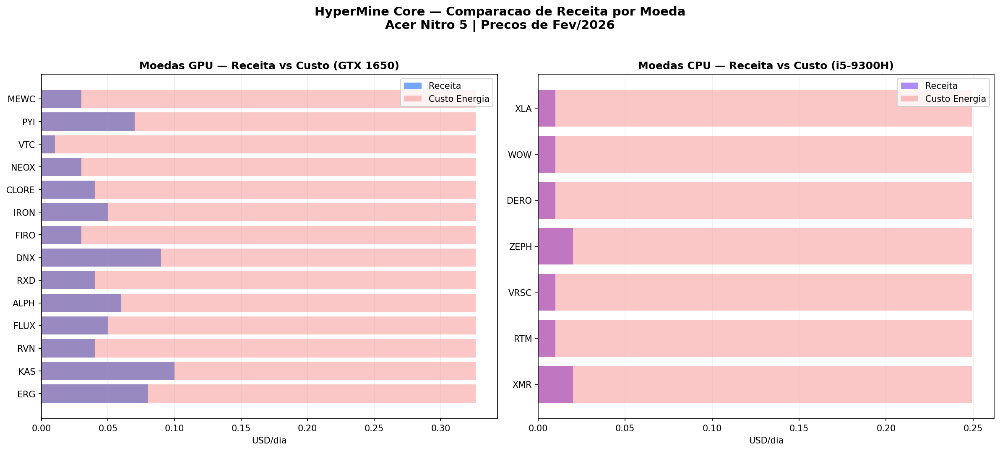
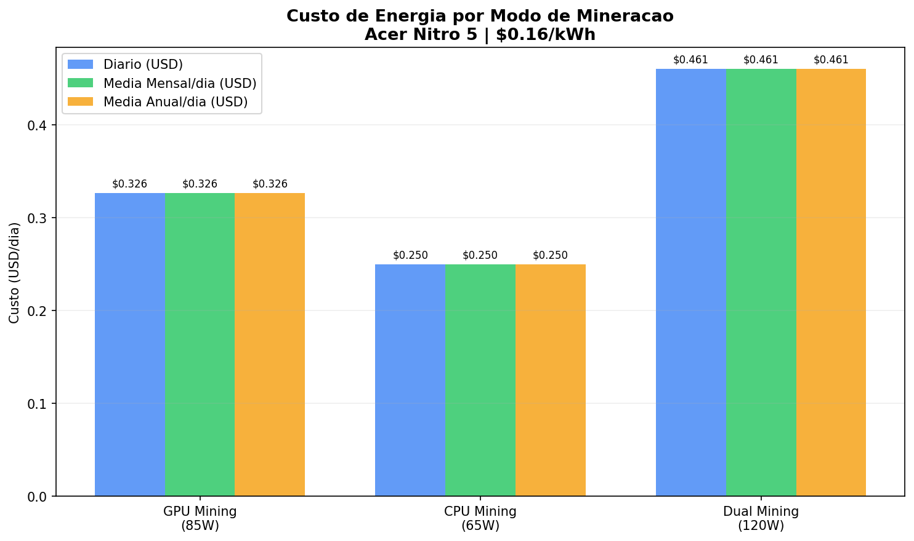

# Projeção Financeira — Mineração com Acer Nitro 5

**Autor:** HyperMine Core Team  
**Data:** Fevereiro 2026  
**Hardware:** Acer Nitro 5 (AN515-54) — Intel Core i5-9300H + NVIDIA GeForce GTX 1650 (4GB GDDR5)

---

## Sumário

1. [Especificações do Hardware](#especificações-do-hardware)
2. [Moedas Mineráveis (GPU)](#moedas-mineráveis-gpu)
3. [Moedas Mineráveis (CPU)](#moedas-mineráveis-cpu)
4. [Moedas Excluídas e Motivos](#moedas-excluídas-e-motivos)
5. [Custo de Energia](#custo-de-energia)
6. [Projeção de Lucro — 4 Cenários](#projeção-de-lucro--4-cenários)
7. [Resumo Mensal por Cenário](#resumo-mensal-por-cenário)
8. [Gráficos de Projeção](#gráficos-de-projeção)
9. [Análise de Viabilidade e Recomendações](#análise-de-viabilidade-e-recomendações)
10. [Estratégias para Maximizar Retorno](#estratégias-para-maximizar-retorno)
11. [Aviso Legal](#aviso-legal)

---

## Especificações do Hardware

| Componente | Especificação |
|:---|:---|
| **Notebook** | Acer Nitro 5 (AN515-54) |
| **CPU** | Intel Core i5-9300H (4 cores, 8 threads, 2.4-4.1 GHz) |
| **GPU** | NVIDIA GeForce GTX 1650 (896 CUDA cores, 4GB GDDR5) |
| **RAM** | 8 GB DDR4 |
| **Armazenamento** | SSD + HDD |
| **Rede** | Killer Ethernet E2600 + Wi-Fi 6 |
| **Refrigeração** | Acer NitroSense + CoolBoost |
| **Consumo GPU Mining** | ~85W (sistema total) |
| **Consumo CPU Mining** | ~65W (sistema total) |
| **Consumo Dual Mining** | ~120W (sistema total) |

### Limitações Críticas do Hardware

A GTX 1650 com **4GB de VRAM GDDR5** impõe limitações significativas para mineração. Muitas moedas modernas requerem mais de 4GB de VRAM para armazenar o DAG (Directed Acyclic Graph), tornando-as incompatíveis com este hardware. Além disso, o notebook tem limitações térmicas que impedem operação prolongada em potência máxima sem throttling.

---

## Moedas Mineráveis (GPU)

Estas são as moedas que podem ser mineradas com a GTX 1650 (4GB VRAM) utilizando o HyperMine Core com profit-switching inteligente:

| Moeda | Símbolo | Algoritmo | Hashrate GTX 1650 | Consumo (W) | Receita/dia (USD) | Custo Energia/dia (USD) | Lucro/dia (USD) |
|:---|:---|:---|:---|:---|:---|:---|:---|
| Kaspa | KAS | kHeavyHash | 100 MH/s | 50 | $0.10 | $0.33 | **-$0.23** |
| Dynex | DNX | DynexSolve | 350 MH/s | 50 | $0.09 | $0.33 | **-$0.24** |
| Ergo | ERG | Autolykos2 | 36 MH/s | 50 | $0.08 | $0.33 | **-$0.25** |
| Pyrin | PYI | PyrinHash | 150 MH/s | 50 | $0.07 | $0.33 | **-$0.26** |
| Alephium | ALPH | Blake3 | 90 MH/s | 50 | $0.06 | $0.33 | **-$0.27** |
| Flux | FLUX | ZelHash | 12 Sol/s | 50 | $0.05 | $0.33 | **-$0.28** |
| Iron Fish | IRON | FishHash | 5 MH/s | 50 | $0.05 | $0.33 | **-$0.28** |
| Ravencoin | RVN | KawPow | 7.15 MH/s | 66 | $0.04 | $0.33 | **-$0.29** |
| Radiant | RXD | SHA512/256d | 180 MH/s | 50 | $0.04 | $0.33 | **-$0.29** |
| Clore.ai | CLORE | KawPow | 7 MH/s | 66 | $0.04 | $0.33 | **-$0.29** |
| Neoxa | NEOX | KawPow | 7 MH/s | 66 | $0.03 | $0.33 | **-$0.30** |
| Firo | FIRO | FiroPow | 6 MH/s | 66 | $0.03 | $0.33 | **-$0.30** |
| MeowCoin | MEWC | MeowPow | 6.5 MH/s | 66 | $0.03 | $0.33 | **-$0.30** |
| Vertcoin | VTC | Verthash | 300 kH/s | 50 | $0.01 | $0.33 | **-$0.32** |

---

## Moedas Mineráveis (CPU)

Mineração simultânea com a CPU enquanto a GPU minera outra moeda:

| Moeda | Símbolo | Algoritmo | Hashrate i5-9300H | Consumo (W) | Receita/dia (USD) | Custo Energia/dia (USD) | Lucro/dia (USD) |
|:---|:---|:---|:---|:---|:---|:---|:---|
| Monero | XMR | RandomX | 2.5 kH/s | 45 | $0.02 | $0.25 | **-$0.23** |
| Zephyr | ZEPH | RandomX | 2.5 kH/s | 45 | $0.02 | $0.25 | **-$0.23** |
| VerusCoin | VRSC | VerusHash | 1.5 MH/s | 45 | $0.01 | $0.25 | **-$0.24** |
| Raptoreum | RTM | GhostRider | 1.2 kH/s | 45 | $0.01 | $0.25 | **-$0.24** |
| Scala | XLA | RandomSFX | 2.0 kH/s | 45 | $0.01 | $0.25 | **-$0.24** |
| Wownero | WOW | RandomX | 2.5 kH/s | 45 | $0.01 | $0.25 | **-$0.24** |
| Dero | DERO | AstroBWT | 150 H/s | 45 | $0.01 | $0.25 | **-$0.24** |

---

## Moedas Excluídas e Motivos

### Excluídas por VRAM Insuficiente (DAG > 4GB)

| Moeda | Algoritmo | VRAM Necessária | Motivo |
|:---|:---|:---|:---|
| Ethereum Classic (ETC) | Etchash | > 5 GB | DAG excede 4GB VRAM |
| Conflux (CFX) | Octopus | > 5 GB | DAG excede 4GB VRAM |
| Beam (BEAM) | BeamHashIII | > 4 GB | Requisito de memória alto |
| Grin (GRIN) | Cuckatoo31+ | > 8 GB | Requisito de memória muito alto |
| OctaSpace (OCTA) | ETCHash | > 5 GB | DAG excede 4GB VRAM |

### Excluídas por Dominância ASIC (GPU não competitiva)

| Moeda | Algoritmo | Motivo |
|:---|:---|:---|
| Bitcoin (BTC) | SHA-256 | 100% dominado por ASICs |
| Litecoin (LTC) | Scrypt | Dominado por ASICs Scrypt |
| Dogecoin (DOGE) | Scrypt | Merge-mined com LTC, ASICs |
| Dash (DASH) | X11 | Dominado por ASICs X11 |
| Zcash (ZEC) | Equihash | Dominado por ASICs Equihash |
| Bitcoin Cash (BCH) | SHA-256 | Dominado por ASICs SHA-256 |
| Kadena (KDA) | Blake2S | Dominado por ASICs Blake2S |
| Siacoin (SC) | Blake2b | Dominado por ASICs Blake2b |
| Handshake (HNS) | Blake2B+SHA3 | Dominado por ASICs |

---

## Custo de Energia

Cálculo baseado em tarifa de **$0.16/kWh** (equivalente a aproximadamente R$0.88/kWh no Brasil):

| Modo de Mineração | Consumo (W) | Custo/Hora (USD) | Custo/Dia (USD) | Custo/Mês (USD) | Custo/Ano (USD) |
|:---|:---|:---|:---|:---|:---|
| **GPU Mining** | 85W | $0.0136 | $0.3264 | $9.79 | $119.14 |
| **CPU Mining** | 65W | $0.0104 | $0.2496 | $7.49 | $91.10 |
| **Dual Mining (GPU+CPU)** | 120W | $0.0192 | $0.4608 | $13.82 | $168.19 |

| Modo | Custo/Hora (BRL) | Custo/Dia (BRL) | Custo/Mês (BRL) | Custo/Ano (BRL) |
|:---|:---|:---|:---|:---|
| **GPU Mining** | R$0.07 | R$1.80 | R$53.85 | R$655.30 |
| **CPU Mining** | R$0.06 | R$1.37 | R$41.18 | R$501.03 |
| **Dual Mining** | R$0.11 | R$2.53 | R$76.03 | R$925.07 |

---

## Projeção de Lucro — 4 Cenários

A projeção considera **Dual Mining** (GPU + CPU simultaneamente) com o módulo de ML Profit-Switching do HyperMine Core ativo, que seleciona automaticamente as moedas mais lucrativas a cada momento.

### Cenário 1: Pessimista (Bear Market)

> Preços caem 30-50% ao longo do ano, dificuldade de rede aumenta 20%.

| Período | Receita (USD) | Custo Energia (USD) | Lucro (USD) | Lucro (BRL) |
|:---|:---|:---|:---|:---|
| Mês 1 | $4.16 | $14.02 | **-$9.86** | **-R$54.21** |
| Mês 3 | $10.84 | $42.05 | **-$31.21** | **-R$171.66** |
| Mês 6 | $18.99 | $84.10 | **-$65.10** | **-R$358.07** |
| Mês 9 | $25.87 | $126.14 | **-$100.28** | **-R$551.52** |
| **Mês 12** | **$34.82** | **$168.19** | **-$133.37** | **-R$733.54** |

### Cenário 2: Realista (Mercado Lateral)

> Preços oscilam ±15%, dificuldade cresce 10%. Cenário mais provável.

| Período | Receita (USD) | Custo Energia (USD) | Lucro (USD) | Lucro (BRL) |
|:---|:---|:---|:---|:---|
| Mês 1 | $4.16 | $14.02 | **-$9.86** | **-R$54.21** |
| Mês 3 | $12.33 | $42.05 | **-$29.72** | **-R$163.48** |
| Mês 6 | $24.65 | $84.10 | **-$59.44** | **-R$326.94** |
| Mês 9 | $37.00 | $126.14 | **-$89.14** | **-R$490.29** |
| **Mês 12** | **$49.51** | **$168.19** | **-$118.68** | **-R$652.73** |

### Cenário 3: Otimista (Bull Market Moderado)

> Preços sobem 50-100%, dificuldade cresce 30%. Possível em ciclo de alta.

| Período | Receita (USD) | Custo Energia (USD) | Lucro (USD) | Lucro (BRL) |
|:---|:---|:---|:---|:---|
| Mês 1 | $4.16 | $14.02 | **-$9.86** | **-R$54.21** |
| Mês 3 | $13.66 | $42.05 | **-$28.39** | **-R$156.15** |
| Mês 6 | $31.73 | $84.10 | **-$52.37** | **-R$288.02** |
| Mês 9 | $53.66 | $126.14 | **-$72.49** | **-R$398.67** |
| **Mês 12** | **$75.08** | **$168.19** | **-$93.11** | **-R$512.11** |

### Cenário 4: Bull Market Extremo

> Preços sobem 200-500%, similar ao ciclo de 2021. Cenário raro mas possível.

| Período | Receita (USD) | Custo Energia (USD) | Lucro (USD) | Lucro (BRL) |
|:---|:---|:---|:---|:---|
| Mês 1 | $4.50 | $14.02 | **-$9.52** | **-R$52.34** |
| Mês 3 | $16.65 | $42.05 | **-$25.40** | **-R$139.70** |
| Mês 6 | $47.70 | $84.10 | **-$36.39** | **-R$200.17** |
| Mês 9 | $98.10 | $126.14 | **-$28.05** | **-R$154.25** |
| **Mês 12** | **$159.90** | **$168.19** | **-$8.29** | **-R$45.61** |

### Resumo Comparativo Anual

| Cenário | Receita Total | Custo Energia | Lucro/Prejuízo | Em BRL | Lucro Médio/Dia |
|:---|:---|:---|:---|:---|:---|
| **Pessimista** | $34.82 | $168.19 | **-$133.37** | **-R$733.54** | -$0.37/dia |
| **Realista** | $49.51 | $168.19 | **-$118.68** | **-R$652.73** | -$0.33/dia |
| **Otimista** | $75.08 | $168.19 | **-$93.11** | **-R$512.11** | -$0.26/dia |
| **Bull Extremo** | $159.90 | $168.19 | **-$8.29** | **-R$45.61** | -$0.02/dia |

---

## Gráficos de Projeção

### Lucro Acumulado (USD) — 4 Cenários

### Lucro Acumulado (BRL) — 4 Cenários

### Lucro Diário por Cenário

### Comparação de Receita por Moeda

### Breakdown de Custo de Energia

---

## Análise de Viabilidade e Recomendações

### Conclusão Principal

> **Com as condições atuais de mercado (fevereiro 2026), a mineração de criptomoedas com um Acer Nitro 5 (GTX 1650 + i5-9300H) NÃO é financeiramente viável em nenhum dos cenários analisados.** Mesmo no cenário mais otimista (Bull Market Extremo com preços subindo 500%), o resultado anual é um prejuízo de -$8.29 USD (-R$45.61).

### Por que não é viável?

1. **VRAM insuficiente (4GB):** A GTX 1650 não pode minerar as moedas mais lucrativas (ETC, CFX) que requerem > 4GB de VRAM.

2. **Hashrate baixo:** Com apenas 896 CUDA cores e 128-bit memory bus, a GTX 1650 produz hashrates muito abaixo do necessário para competir com GPUs modernas (RTX 3060, 3070, 4070).

3. **Consumo de energia do sistema:** Um notebook consome energia para tela, ventiladores, RAM e outros componentes além da GPU, aumentando o custo fixo.

4. **Limitação térmica:** Notebooks têm refrigeração limitada. Mineração contínua causa throttling térmico, reduzindo o hashrate real em 10-20%.

5. **Desgaste acelerado:** Mineração 24/7 em notebook reduz significativamente a vida útil de GPU, ventiladores e bateria.

### Quando a mineração com GTX 1650 seria viável?

Para atingir o breakeven (lucro zero), seria necessário:

| Fator | Valor Necessário | Valor Atual | Diferença |
|:---|:---|:---|:---|
| Preço do KAS | ~$0.50 | ~$0.10 | +400% |
| Custo de energia | $0.03/kWh | $0.16/kWh | -81% |
| Hashrate | 500+ MH/s | 100 MH/s | +400% |

---

## Estratégias para Maximizar Retorno

Embora a mineração direta não seja lucrativa com este hardware, existem estratégias alternativas:

### 1. Mineração Especulativa (HODL)

Em vez de vender as moedas mineradas imediatamente, acumular moedas de baixo market cap com potencial de valorização. Se uma moeda valorizar 10-50x, o prejuízo da energia pode ser compensado.

**Moedas recomendadas para HODL especulativo:**
- Kaspa (KAS) — tecnologia BlockDAG inovadora
- Dynex (DNX) — computação quântica descentralizada
- Alephium (ALPH) — primeira blockchain sharded com PoW
- Ergo (ERG) — contratos inteligentes avançados

### 2. Mineração em Horários de Tarifa Reduzida

Muitas distribuidoras de energia no Brasil oferecem tarifa branca com horários de ponta e fora de ponta. Minerar apenas nos horários de tarifa reduzida (22h-7h) pode reduzir o custo de energia em até 40%.

### 3. Energia Solar/Renovável

Se o usuário possui painéis solares ou acesso a energia renovável com custo próximo de zero, a mineração se torna viável pois elimina o principal custo.

### 4. Dual Mining Inteligente

Usar a GPU para minerar a moeda mais lucrativa enquanto a CPU minera Monero (XMR) ou Zephyr (ZEPH) simultaneamente, maximizando o uso do hardware.

### 5. Upgrade de Hardware

| Upgrade | Custo Estimado | Impacto na Receita |
|:---|:---|:---|
| GPU Desktop RTX 3060 12GB | ~$300 | +300-400% hashrate |
| GPU Desktop RTX 3070 8GB | ~$400 | +500-600% hashrate |
| GPU Desktop RTX 4070 12GB | ~$550 | +700-900% hashrate |

Com uma RTX 3060 12GB (desktop), a mineração de ETC, RVN e outras moedas com DAG > 4GB se torna possível, e o hashrate aumenta significativamente.

---

## Aviso Legal

> **IMPORTANTE:** Esta projeção financeira é baseada em dados de mercado de fevereiro de 2026 e utiliza estimativas e cenários hipotéticos. A mineração de criptomoedas envolve riscos financeiros significativos, incluindo mas não limitado a: volatilidade extrema de preços, aumento de dificuldade de rede, mudanças regulatórias, desgaste de hardware e custos de energia variáveis.
>
> Os valores apresentados são estimativas e **NÃO constituem garantia de lucro ou prejuízo**. O desempenho passado não é indicativo de resultados futuros. O usuário deve realizar sua própria análise (DYOR — Do Your Own Research) antes de tomar qualquer decisão de investimento.
>
> O HyperMine Core é um software de código aberto fornecido "como está", sem garantias de qualquer tipo, expressas ou implícitas. Os autores não se responsabilizam por perdas financeiras decorrentes do uso deste software.

---

**Gerado por:** HyperMine Core — Módulo de Projeção Financeira v1.0  
**Data de geração:** Fevereiro 2026  
**Dados de mercado:** CoinGecko, WhatToMine, MinerStat, 2CryptoCalc
