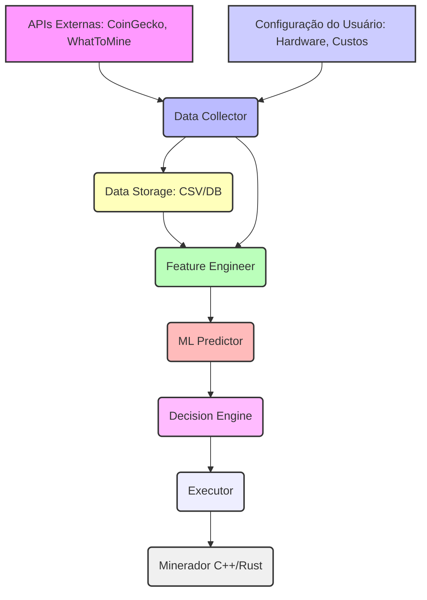

# Design Completo do Módulo ML para Profit-Switching

**Fonte:** Google Gemini 2.5 Flash
**Data:** Fevereiro 2026

---

Absolutamente! Vamos projetar e implementar um módulo completo de Machine Learning para profit-switching automático em mineração de criptomoedas.

---

## Módulo de Profit-Switching com Machine Learning

### 1. ARQUITETURA DO SISTEMA

O sistema é modular, permitindo a fácil manutenção e escalabilidade.

**Componentes:**

1.  **Data Collector (Coletor de Dados):**
    *   **Função:** Busca dados em tempo real e históricos de diversas APIs e fontes.
    *   **Fontes:** CoinGecko (preços, volumes), WhatToMine (dificuldade, hashrate de rede, block reward), dados de hardware do usuário (config. local).
    *   **Saída:** Dados brutos em formato padronizado (e.g., JSON, DataFrame Pandas).
    *   **Frequência:** Cada 5-15 minutos (para dados em tempo real), diariamente/semanalmente (para dados históricos de treinamento).

2.  **Data Storage (Armazenamento de Dados):**
    *   **Função:** Armazena dados brutos coletados e features engenheiradas para treinamento e validação do modelo.
    *   **Tecnologia:** Simplesmente arquivos CSV/Parquet ou um banco de dados NoSQL (e.g., MongoDB) ou SQL leve (e.g., SQLite) para este caso.
    *   **Saída:** Dados históricos disponíveis para o Feature Engineer e ML Predictor.

3.  **Feature Engineer (Engenheiro de Features):**
    *   **Função:** Transforma dados brutos em features úteis para o modelo de ML. Calcula métricas derivadas, tendências, moving averages, etc.
    *   **Entrada:** Dados brutos do Data Collector e Data Storage.
    *   **Saída:** DataFrame com features processadas, pronto para o ML Predictor.
    *   **Frequência:** Sincronizado com a coleta de dados e treinamento/predição.

4.  **ML Predictor (Preditor de ML):**
    *   **Função:** Carrega o(s) modelo(s) de ML treinado(s) e faz predições de lucratividade para cada moeda potencial.
    *   **Entrada:** Features processadas pelo Feature Engineer.
    *   **Saída:** Predição de lucratividade (e.g., lucro diário esperado em USD) para cada moeda.
    *   **Frequência:** Cada 5-15 minutos (sincronizado com a coleta e decisão).

5.  **Decision Engine (Motor de Decisão):**
    *   **Função:** Analisa as predições de lucratividade, o estado atual do minerador e aplica regras de negócio (e.g., hysteresis) para determinar a ação.
    *   **Entrada:** Predições do ML Predictor, moeda atualmente minerada, parâmetros de hysteresis e overhead de troca.
    *   **Saída:** Comando de ação (e.g., "switch para ETH", "manter BTC").
    *   **Frequência:** Cada 5-15 minutos (sincronizado com a predição).

6.  **Executor (Executador):**
    *   **Função:** Traduz o comando do Decision Engine em uma ação real, comunicando-se com o software de mineração.
    *   **Entrada:** Comando de ação do Decision Engine.
    *   **Saída:** Mensagem para o minerador (via socket, arquivo, etc.) para trocar de algoritmo/moeda ou continuar.
    *   **Frequência:** Somente quando um comando de troca é emitido pelo Decision Engine.

**Fluxo de Dados:**



**Frequência de Coleta e Predição:**

*   **Coleta de Dados em Tempo Real:** A cada 5-15 minutos. Isso é um bom equilíbrio entre capturar mudanças de mercado e não sobrecarregar as APIs.
*   **Coleta de Dados Históricos:** Diariamente ou semanalmente, para enriquecer o conjunto de dados de treinamento.
*   **Feature Engineering:** Executado após cada coleta de dados em tempo real e antes do treinamento do modelo.
*   **Predição em Tempo Real:** A cada 5-15 minutos, sincronizado com a coleta de dados.
*   **Decisão e Execução:** A cada 5-15 minutos, após a predição.
*   **Treinamento do Modelo:** Diariamente ou semanalmente, usando o conjunto de dados históricos atualizado.

---

### 2. FEATURES DO MODELO (Variáveis de Entrada)

A meta é que o modelo preveja a "lucratividade futura" (e.g., lucro diário em USD) de cada moeda.

**Dados Brutos:**

1.  **Preço atual da moeda (USD):** `coin_price_usd`
2.  **Preço histórico (24h, 7d, 30d):** `coin_price_24h_ago`, `coin_price_7d_ago`, `coin_price_30d_ago`
3.  **Dificuldade da rede atual:** `network_difficulty`
4.  **Dificuldade da rede histórica (24h, 7d, 30d):** `network_difficulty_24h_ago`, `network_difficulty_7d_ago`, `network_difficulty_30d_ago`
5.  **Hashrate da rede atual:** `network_hashrate`
6.  **Hashrate da rede histórica (24h, 7d, 30d):** `network_hashrate_24h_ago`, `network_hashrate_7d_ago`, `network_hashrate_30d_ago`
7.  **Block reward (moeda por bloco):** `block_reward_coin`
8.  **Volume de negociação (24h) da moeda:** `trading_volume_24h_usd`
9.  **Custo de energia local (USD/kWh):** `energy_cost_usd_kwh` (parâmetro de configuração do usuário)
10. **Hashrate do hardware do usuário por algoritmo (MH/s, GH/s, TH/s):** `hardware_hashrate_algo` (parâmetro de configuração do usuário)
11. **Tempo de troca de algoritmo (overhead em segundos/minutos):** `switching_overhead_time_sec` (parâmetro de configuração do usuário)
12. **Taxas de pool (%):** `pool_fees_pct` (parâmetro de configuração do usuário)
13. **Timestamp da coleta de dados:** Para criar features temporais.

**Features Engenheiradas (exemplo):**

*   **Tendências de Preço:**
    *   `price_change_24h_pct`: `(current_price - price_24h_ago) / price_24h_ago * 100`
    *   `price_change_7d_pct`, `price_change_30d_pct`
    *   `price_volatility_7d`: Desvio padrão dos preços diários nos últimos 7 dias.
*   **Tendências de Dificuldade:**
    *   `difficulty_change_24h_pct`, `difficulty_7d_pct`, `difficulty_30d_pct`
*   **Tendências de Hashrate de Rede:**
    *   `network_hashrate_change_24h_pct`, `network_hashrate_7d_pct`, `network_hashrate_30d_pct`
*   **Relações de Mercado:**
    *   `price_to_difficulty_ratio`: `current_price / network_difficulty`
    *   `volume_to_marketcap_ratio`: `trading_volume_24h_usd / coin_market_cap_usd` (se disponível)
*   **Métricas de Desempenho Internas:**
    *   `estimated_revenue_per_hash_rate`: `(block_reward_coin * current_price * (1 - pool_fees_pct)) / network_difficulty` (normalizado para uma unidade de hashrate, e.g., 1 TH/s)
    *   `estimated_energy_cost_per_hash_rate`: (custo de energia * consumo de energia do hardware) / hashrate do hardware (normalizado)
*   **Features Temporais:**
    *   `hour_of_day`: `timestamp.hour`
    *   `day_of_week`: `timestamp.weekday()`
    *   `is_weekend`: `1` se `day_of_week` for 5 ou 6, `0` caso contrário.
*   **Lagged Features:**
    *   `lag_1h_profitability_of_coin`: Lucratividade real da moeda 1 hora atrás (se disponível no histórico).
*   **Parâmetros do Usuário:** Serão diretamente incluídos no DataFrame de features para cada moeda.

**Variável Alvo (Target Variable):**

*   **`expected_daily_profit_usd`**: O lucro diário em USD esperado ao minerar essa moeda, ajustado pelos custos de energia e taxas de pool. Esta é a variável que o modelo tentará prever.
    *   Cálculo base: `(block_reward_coin * current_price * (1 - pool_fees_pct) * hashrate_do_usuario_no_algo / network_difficulty * unidades_de_tempo_no_dia) - (energia_consumida_pelo_hardware * energy_cost_usd_kwh)`

---

### 3. MODELO DE ML RECOMENDADO

Considerando a natureza tabular dos dados, a necessidade de performance e a interpretabilidade, os modelos baseados em árvores são excelentes escolhas.

*   **Modelo Principal:**
    *   **XGBoost (Extreme Gradient Boosting)** ou **LightGBM (Light Gradient Boosting Machine)**.
    *   **Motivo:** Ambos são muito eficientes, robustos, lidam bem com dados tabulares, são resistentes a outliers e oferecem excelente performance para problemas de regressão. LightGBM costuma ser mais rápido para grandes conjuntos de dados.
    *   **Tipo:** Regressor (e.g., `XGBRegressor`, `LGBMRegressor`).

*   **Fallback/Modelo Secundário:**
    *   **Random Forest Regressor.**
    *   **Motivo:** Menos propenso a overfitting que um único Decision Tree, bom desempenho, e serve como um bom modelo de referência ou de fallback caso os modelos de boosting apresentem instabilidade.

*   **Ensemble de Modelos para Robustez:**
    *   **Abordagem:** Treinar todos os modelos (XGBoost, LightGBM, Random Forest) separadamente. Na fase de predição, a predição final de lucratividade para cada moeda será a *média ponderada* das predições de cada modelo. Pesos podem ser baseados na performance (e.g., menor RMSE no conjunto de validação) ou simplesmente médios.
    *   **Motivo:** Reduz a variância, melhora a robustez e frequentemente resulta em predições mais precisas do que um único modelo.

**Métricas para Avaliação do Modelo:**

*   **RMSE (Root Mean Squared Error):** Mede a magnitude média dos erros de predição. Penaliza erros maiores.
*   **MAE (Mean Absolute Error):** Mede a magnitude média dos erros de predição, sem penalizar tanto erros maiores. Mais fácil de interpretar.
*   **R² (Coefficient of Determination):** Indica a proporção da variância na variável dependente que é previsível a partir das variáveis independentes. Um R² de 1 indica um ajuste perfeito.
*   **Sharpe Ratio (para avaliação da estratégia, não do modelo diretamente):** Embora listado, o Sharpe Ratio é mais aplicável para avaliar a performance de um *portfólio* ou *estratégia de investimento* ao longo do tempo (retorno por unidade de risco), e não a acurácia de um modelo de regressão pontual. No entanto, pode ser usado para *avaliar a performance do sistema completo* (o profit-switcher) ao longo do tempo, comparando os lucros obtidos com o risco (e.g., volatilidade dos lucros).

---

### 4. CÓDIGO PYTHON COMPLETO

Vamos estruturar o código em um fluxo que represente os componentes da arquitetura.

Primeiro, crie um arquivo `config.py` para as configurações:

```python
# config.py
import os

# API Keys
COINGECKO_API_BASE = "https://api.coingecko.com/api/v3"
WHAT_TO_MINE_API_BASE = "https://whattomine.com/coins.json"

# Hardware e Custos do Usuário
# Estes são exemplos, ajuste conforme seu hardware e localização
USER_HARDWARE_CONFIG = {
    "ETHASH": { # Exemplo para ETH (ou ETC, RVN no futuro)
        "algo_name": "Ethash",
        "hashrate_ghs": 0.060, # 60 MH/s
        "power_watts": 150,
        "efficiency_joules_per_gh": 2.5 # Exemplo: 150W / 0.060 GH/s = 2500 J/GH
    },
    "KAWPOW": { # Exemplo para RVN
        "algo_name": "KawPow",
        "hashrate_ghs": 0.030, # 30 MH/s
        "power_watts": 200,
        "efficiency_joules_per_gh": 6.6
    },
    # Adicione outros algoritmos/moedas que você pode minerar
}

ENERGY_COST_USD_KWH = 0.12 # Custo da energia em USD por kWh
POOL_FEES_PCT = 0.01 # 1% de taxas de pool

# Parâmetros do Sistema
SWITCHING_OVERHEAD_TIME_MIN = 2 # Tempo em minutos para trocar de algoritmo (downtime)
HYSTERESIS_THRESHOLD_PCT = 0.03 # 3% de melhoria de lucro para justificar a troca
DATA_COLLECTION_INTERVAL_SEC = 300 # 5 minutos
HISTORICAL_DATA_FILE = "historical_mining_data.csv"
MODEL_PATH_PREFIX = "ml_model_" # Prefixo para salvar os modelos treinados
CURRENT_MINING_STATE_FILE = "current_mining_state.json" # Para persistir o estado atual

# Moedas de interesse (IDs da CoinGecko e Algoritmos da WhatToMine)
# Certifique-se de que os IDs correspondem à CoinGecko e os algoritmos à WhatToMine
INTERESTED_COINS = {
    "ethereum": "ETHASH",
    "ethereum-classic": "ETHASH",
    "ravencoin": "KAWPOW",
    # "ergo": "AUTOLYKOS", # Exemplo de outra moeda/algo
}

# Configuração para comunicação com o minerador (Unix Socket)
# O minerador deve estar escutando neste socket
MINER_SOCKET_PATH = "/tmp/miner_socket.sock"
MINER_SOCKET_TIMEOUT = 5 # segundos

# Formato da mensagem de switching (para o executor)
SWITCH_COMMAND_FORMAT = {
    "command": "switch_coin",
    "coin_id": None,
    "pool_url": "stratum+tcp://<pool_address>:<pool_port>", # Placeholder, minerador deve substituir
    "wallet_address": "<your_wallet_address>", # Placeholder, minerador deve substituir
    "algo": None
}
NO_CHANGE_COMMAND_FORMAT = {"command": "no_change"}
```

Agora, o código principal:

```python
# main_ml_switcher.py
import requests
import pandas as pd
import numpy as np
import time
import os
import json
import logging
from datetime import datetime, timedelta
from sklearn.model_selection import train_test_split
from sklearn.metrics import mean_squared_error, mean_absolute_error, r2_score
from xgboost import XGBRegressor
from lightgbm import LGBMRegressor
from sklearn.ensemble import RandomForestRegressor
import joblib
import socket

# Carregar configurações
import config

# Configuração de logging
logging.basicConfig(level=logging.INFO, format='%(asctime)s - %(levelname)s - %(message)s')

# --- Funções Auxiliares ---

def save_current_mining_state(coin_id, last_profit_usd):
    state = {"current_coin_id": coin_id, "last_profit_usd": last_profit_usd, "timestamp": datetime.now().isoformat()}
    with open(config.CURRENT_MINING_STATE_FILE, 'w') as f:
        json.dump(state, f)

def load_current_mining_state():
    if os.path.exists(config.CURRENT_MINING_STATE_FILE):
        with open(config.CURRENT_MINING_STATE_FILE, 'r') as f:
            state = json.load(f)
            return state.get("current_coin_id"), state.get("last_profit_usd")
    return None, 0.0 # Sem moeda minerada inicialmente ou lucro zero

# --- 1. Data Collector ---

def collect_coingecko_data(coin_ids, days=30):
    """Coleta dados de preço e volume da CoinGecko."""
    prices = {}
    volumes = {}
    market_caps = {}
    historical_data = {}

    for coin_id in coin_ids:
        try:
            # Preço atual
            current_data = requests.get(
                f"{config.COINGECKO_API_BASE}/simple/price",
                params={"ids": coin_id, "vs_currencies": "usd", "include_24hr_vol": "true", "include_market_cap": "true"}
            ).json()
            if coin_id in current_data and 'usd' in current_data[coin_id]:
                prices[coin_id] = current_data[coin_id]['usd']
                volumes[coin_id] = current_data[coin_id]['usd_24h_vol']
                market_caps[coin_id] = current_data[coin_id]['usd_market_cap']
            else:
                logging.warning(f"Dados atuais para {coin_id} não encontrados na CoinGecko.")
                prices[coin_id] = None
                volumes[coin_id] = None
                market_caps[coin_id] = None


            # Dados históricos (para tendências e features)
            hist_response = requests.get(
                f"{config.COINGECKO_API_BASE}/coins/{coin_id}/market_chart",
                params={"vs_currency": "usd", "days": days, "interval": "daily"}
            ).json()

            if 'prices' in hist_response and hist_response['prices']:
                hist_df = pd.DataFrame(hist_response['prices'], columns=['timestamp', 'price'])
                hist_df['timestamp'] = pd.to_datetime(hist_df['timestamp'], unit='ms')
                hist_df = hist_df.set_index('timestamp')
                historical_data[coin_id] = hist_df
            else:
                logging.warning(f"Dados históricos para {coin_id} não encontrados na CoinGecko.")
                historical_data[coin_id] = pd.DataFrame()

        except requests.exceptions.RequestException as e:
            logging.error(f"Erro ao coletar dados da CoinGecko para {coin_id}: {e}")
            prices[coin_id] = None
            volumes[coin_id] = None
            market_caps[coin_id] = None
            historical_data[coin_id] = pd.DataFrame()

    return prices, volumes, market_caps, historical_data

def collect_whattomine_data():
    """Coleta dados de dificuldade, hashrate de rede e block reward da WhatToMine."""
    whattomine_data = {}
    try:
        response = requests.get(config.WHAT_TO_MINE_API_BASE)
        response.raise_for_status() # Lança um erro para códigos de status ruins (4xx ou 5xx)
        data = response.json()
        if 'coins' in data:
            for coin_name, coin_info in data['coins'].items():
                whattomine_data[coin_name.lower()] = { # Normalizar para minúsculas para fácil comparação
                    "algo": coin_info.get("algorithm"),
                    "block_reward": coin_info.get("block_reward"),
                    "nethash": coin_info.get("nethash"), # em GH/s
                    "difficulty": coin_info.get("difficulty"),
                    "block_time": coin_info.get("block_time"),
                    "profitability": coin_info.get("profitability"), # Profitabilidade relativa para 1 GH/s
                    "timestamp": datetime.now().isoformat() # Adiciona timestamp para histórico
                }
        else:
            logging.error("Formato inesperado da API WhatToMine: 'coins' não encontrado.")

    except requests.exceptions.RequestException as e:
        logging.error(f"Erro ao coletar dados da WhatToMine: {e}")
    except json.JSONDecodeError as e:
        logging.error(f"Erro ao decodificar JSON da WhatToMine: {e}")
    return whattomine_data

def get_current_data_point(interested_coin_ids):
    """
    Coleta todos os dados atuais e históricos para as moedas de interesse.
    Retorna um DataFrame com uma linha para cada moeda e suas features brutas.
    """
    current_time = datetime.now()
    
    # Coleta CoinGecko
    cg_prices, cg_volumes, cg_market_caps, cg_historical_data = collect_coingecko_data(interested_coin_ids, days=30)
    
    # Coleta WhatToMine
    wtm_data = collect_whattomine_data()

    # Prepara DataFrame de dados brutos
    raw_data_points = []
    for cg_id, algo in config.INTERESTED_COINS.items():
        coin_wtm_data = next((v for k, v in wtm_data.items() if v['algo'] == algo), None)
        
        if not coin_wtm_data or cg_prices.get(cg_id) is None:
            logging.warning(f"Dados incompletos para {cg_id} ({algo}). Pulando.")
            continue

        data_row = {
            "timestamp": current_time,
            "coin_id": cg_id,
            "algo": algo,
            "current_price_usd": cg_prices.get(cg_id),
            "volume_24h_usd": cg_volumes.get(cg_id),
            "market_cap_usd": cg_market_caps.get(cg_id),
            "network_difficulty": coin_wtm_data.get("difficulty"),
            "network_hashrate_ghs": coin_wtm_data.get("nethash"), # WhatToMine já dá em GH/s
            "block_reward_coin": coin_wtm_data.get("block_reward"),
            "block_time_sec": coin_wtm_data.get("block_time"),
        }
        
        # Adicionar dados históricos de preço da CoinGecko (se disponível)
        if cg_id in cg_historical_data and not cg_historical_data[cg_id].empty:
            hist_df = cg_historical_data[cg_id]
            
            # Ajustar para o fuso horário se necessário, ou garantir que a comparação seja correta
            hist_df_utc = hist_df.copy()
            
            # Buscar preços de 24h, 7d, 30d atrás
            for days_ago in [1, 7, 30]:
                past_time = current_time - timedelta(days=days_ago)
                # Encontrar o ponto mais próximo no histórico
                if not hist_df_utc.empty:
                    idx = hist_df_utc.index.asof(past_time)
                    if idx:
                        data_row[f"price_{days_ago}d_ago_usd"] = hist_df_utc.loc[idx, 'price']
                    else:
                        data_row[f"price_{days_ago}d_ago_usd"] = None
                else:
                    data_row[f"price_{days_ago}d_ago_usd"] = None
        else:
             for days_ago in [1, 7, 30]:
                data_row[f"price_{days_ago}d_ago_usd"] = None


        raw_data_points.append(data_row)
    
    raw_df = pd.DataFrame(raw_data_points)
    return raw_df


# --- 2. Data Storage (para treinamento) ---

def load_historical_data():
    if os.path.exists(config.HISTORICAL_DATA_FILE):
        df = pd.read_csv(config.HISTORICAL_DATA_FILE, parse_dates=['timestamp'])
        return df
    return pd.DataFrame()

def save_historical_data(df):
    df.to_csv(config.HISTORICAL_DATA_FILE, index=False)
    logging.info(f"Dados históricos salvos em {config.HISTORICAL_DATA_FILE}")

# --- 3. Feature Engineer ---

def create_features(df):
    """
    Cria features para o modelo de ML a partir dos dados brutos.
    O DataFrame de entrada deve conter uma linha por moeda, com as colunas brutas.
    """
    if df.empty:
        return pd.DataFrame()

    df_fe = df.copy()

    # Garantir que o timestamp esteja em formato datetime
    df_fe['timestamp'] = pd.to_datetime(df_fe['timestamp'])

    # Features Temporais
    df_fe['hour_of_day'] = df_fe['timestamp'].dt.hour
    df_fe['day_of_week'] = df_fe['timestamp'].dt.dayofweek
    df_fe['is_weekend'] = ((df_fe['day_of_week'] == 5) | (df_fe['day_of_week'] == 6)).astype(int)

    # Preencher N/A para preços históricos se faltarem (com o preço atual como fallback simples)
    for days_ago in [1, 7, 30]:
        col = f"price_{days_ago}d_ago_usd"
        df_fe[col] = df_fe[col].fillna(df_fe['current_price_usd'])

    # Tendências de Preço
    df_fe['price_change_24h_pct'] = (df_fe['current_price_usd'] - df_fe['price_1d_ago_usd']) / df_fe['price_1d_ago_usd']
    df_fe['price_change_7d_pct'] = (df_fe['current_price_usd'] - df_fe['price_7d_ago_usd']) / df_fe['price_7d_ago_usd']
    df_fe['price_change_30d_pct'] = (df_fe['current_price_usd'] - df_fe['price_30d_ago_usd']) / df_fe['price_30d_ago_usd']

    # Ratios de Mercado
    df_fe['price_to_volume_ratio'] = df_fe['current_price_usd'] / (df_fe['volume_24h_usd'] + 1e-9) # Evitar divisão por zero

    # Adicionar parâmetros de hardware e custos do usuário para cada linha de moeda
    for algo, hw_config in config.USER_HARDWARE_CONFIG.items():
        # Apenas para as linhas onde o algoritmo corresponde
        mask = df_fe['algo'] == algo
        df_fe.loc[mask, 'user_hashrate_ghs'] = hw_config['hashrate_ghs']
        df_fe.loc[mask, 'user_power_watts'] = hw_config['power_watts']
        df_fe.loc[mask, 'user_efficiency_joules_per_gh'] = hw_config['efficiency_joules_per_gh']

    # Preencher com 0 ou outro valor padrão caso haja algoritmos no DF que não estão na config do usuário
    df_fe['user_hashrate_ghs'] = df_fe['user_hashrate_ghs'].fillna(0)
    df_fe['user_power_watts'] = df_fe['user_power_watts'].fillna(0)
    df_fe['user_efficiency_joules_per_gh'] = df_fe['user_efficiency_joules_per_gh'].fillna(0)
    
    # Adicionar custos globais
    df_fe['energy_cost_usd_kwh'] = config.ENERGY_COST_USD_KWH
    df_fe['pool_fees_pct'] = config.POOL_FEES_PCT

    # Calcular a variável alvo (Lucro Diário Esperado em USD)
    # 1 BTC = 10^9 GH/s. 1 TH/s = 1000 GH/s. WhatToMine nethash em GH/s.
    # Block reward é por bloco. Block time é em segundos.
    # Hashrate do usuário é em GH/s.
    # Formula para Lucro: ( (Block_Reward * Price * Hashrate_Usuário / Dificuldade * (86400 / Block_Time)) * (1 - Pool_Fees) ) - Custo_Energia

    # 86400 segundos em um dia.
    # network_difficulty é um multiplicador sobre 2^32, então para calcular a "quantidade de trabalho"
    # que o minerador precisa fazer, usa-se difficulty * 2^32.
    # WhatToMine já normaliza muita coisa, então vamos seguir a lógica mais comum para lucro.
    # Um cálculo mais direto é WhatToMine's 'profitability' * user_hashrate * current_price * (1-fees) - energy_cost

    # Para um cálculo mais "puro" baseado nos dados brutos:
    # `blocks_per_day = 86400 / block_time_sec`
    # `coins_per_day = blocks_per_day * block_reward_coin * (user_hashrate_ghs / network_hashrate_ghs)`
    # `revenue_usd = coins_per_day * current_price_usd * (1 - pool_fees_pct)`
    # `energy_cost_usd = (user_power_watts / 1000) * 24 * energy_cost_usd_kwh` (Watts para kW, *24h)
    # `expected_daily_profit_usd = revenue_usd - energy_cost_usd`

    # Tratamento para evitar divisão por zero ou nans
    df_fe['network_hashrate_ghs'] = df_fe['network_hashrate_ghs'].replace(0, np.nan)
    df_fe['block_time_sec'] = df_fe['block_time_sec'].replace(0, np.nan)
    df_fe['network_difficulty'] = df_fe['network_difficulty'].replace(0, np.nan)

    # Calcular blocks_per_day antes do nans
    df_fe['blocks_per_day'] = 86400 / df_fe['block_time_sec']

    # Receita diária antes das taxas
    # A fórmula precisa ser cuidadosa com as unidades. WhatToMine nethash é geralmente em GH/s.
    # user_hashrate_ghs já está em GH/s.
    # A proporção `user_hashrate_ghs / network_hashrate_ghs` representa a chance de encontrar um bloco.
    # O cálculo deve ser `(block_reward * coins_per_day) * price * (1 - pool_fees)`
    # Um cálculo mais direto de "coins por dia" pode ser baseado na dificuldade e hashrate:
    # `hash_per_coin_per_day = (network_difficulty * (2**32)) / blocks_per_day`
    # `coins_per_day_per_ghs = 1 / (hash_per_coin_per_day / (10**9))` se nethash é em GH/s

    # Método mais prático para lucro diário com base em WhatToMine:
    # WhatToMine geralmente fornece uma "profitability" por GH/s ou TH/s. Vamos assumir que
    # o 'profitability' da WTM é uma base por 1 GH/s em USD para simplificar, e ajustar.
    # Se 'profitability' já é um valor em USD por GH/s, basta multiplicar.
    # Caso contrário, construímos.

    # Vamos tentar construir o lucro diário para cada moeda
    df_fe['coins_per_day_user'] = (df_fe['blocks_per_day'] * df_fe['block_reward_coin'] *
                                    (df_fe['user_hashrate_ghs'] / df_fe['network_hashrate_ghs']))

    df_fe['revenue_usd'] = df_fe['coins_per_day_user'] * df_fe['current_price_usd'] * (1 - df_fe['pool_fees_pct'])
    df_fe['energy_cost_usd'] = (df_fe['user_power_watts'] / 1000) * 24 * df_fe['energy_cost_usd_kwh']

    df_fe['expected_daily_profit_usd'] = df_fe['revenue_usd'] - df_fe['energy_cost_usd']
    
    # Limpeza de NaNs/Infs que podem surgir de divisões por zero ou dados ausentes
    df_fe = df_fe.replace([np.inf, -np.inf], np.nan)
    df_fe = df_fe.dropna(subset=['expected_daily_profit_usd']) # Dropar linhas onde não podemos calcular lucro

    return df_fe

def preprocess_for_prediction(df):
    """
    Prepara o DataFrame com features para a predição.
    Lida com colunas categóricas e seleciona features.
    """
    if df.empty:
        return df, []

    # Features que serão usadas no modelo
    feature_cols = [
        'current_price_usd', 'volume_24h_usd', 'market_cap_usd',
        'network_difficulty', 'network_hashrate_ghs', 'block_reward_coin', 'block_time_sec',
        'hour_of_day', 'day_of_week', 'is_weekend',
        'price_change_24h_pct', 'price_change_7d_pct', 'price_change_30d_pct',
        'price_to_volume_ratio',
        'user_hashrate_ghs', 'user_power_watts', 'energy_cost_usd_kwh', 'pool_fees_pct',
        # 'user_efficiency_joules_per_gh' # pode ser redundante se power/hashrate já estão
    ]
    
    # Adicionar dummy variables para 'algo' se for uma feature importante e não numérica
    # Ou usar Label Encoding/One-Hot Encoding. Para este exemplo, vamos manter 'algo'
    # como uma feature categórica que o LightGBM/XGBoost podem lidar diretamente,
    # ou podemos simplesmente usar o one-hot encoding.
    
    # Para simplicidade, vamos usar one-hot encoding para 'algo'
    df_processed = pd.get_dummies(df, columns=['algo'], prefix='algo', drop_first=True)
    
    # Atualizar feature_cols com as novas colunas de algo
    algo_cols = [col for col in df_processed.columns if col.startswith('algo_')]
    feature_cols.extend(algo_cols)

    # Filtrar para apenas as colunas de feature que realmente existem
    feature_cols_exist = [col for col in feature_cols if col in df_processed.columns]
    
    # Garantir que todas as colunas numéricas que serão usadas não tenham NaNs
    # Usar a média para preencher NaNs nas features é um fallback simples.
    # Uma estratégia melhor seria usar um imputador ou técnicas mais avançadas.
    for col in feature_cols_exist:
        if df_processed[col].dtype in ['float64', 'int64']:
            df_processed[col] = df_processed[col].fillna(df_processed[col].mean())
            
    # Garantir que todas as colunas de algo_dummy existam para a predição
    # Este é um passo crítico para a consistência entre treinamento e predição
    all_algos = list(set([cfg['algo_name'] for cfg in config.USER_HARDWARE_CONFIG.values()]))
    for algo in all_algos:
        dummy_col_name = f'algo_{algo}'
        if dummy_col_name not in df_processed.columns:
            df_processed[dummy_col_name] = 0 # Adicionar coluna com zeros se não estiver presente

    return df_processed, feature_cols_exist


# --- 4. ML Predictor (Treinamento e Predição) ---

def train_models(historical_df):
    """
    Treina os modelos de ML com os dados históricos.
    Salva os modelos treinados.
    """
    if historical_df.empty or 'expected_daily_profit_usd' not in historical_df.columns:
        logging.warning("Não há dados históricos suficientes ou a coluna alvo não existe para treinamento.")
        return

    # Pré-processar dados para treinamento
    processed_df, feature_cols = preprocess_for_prediction(historical_df)
    
    if processed_df.empty or not feature_cols:
        logging.warning("DataFrame processado vazio ou sem features para treinamento.")
        return

    X = processed_df[feature_cols]
    y = processed_df['expected_daily_profit_usd']

    # Dividir dados em treinamento e teste
    X_train, X_test, y_train, y_test = train_test_split(X, y, test_size=0.2, random_state=42)

    models = {
        "xgboost": XGBRegressor(objective='reg:squarederror', n_estimators=100, random_state=42, n_jobs=-1),
        "lightgbm": LGBMRegressor(objective='regression', n_estimators=100, random_state=42, n_jobs=-1),
        "random_forest": RandomForestRegressor(n_estimators=100, random_state=42, n_jobs=-1)
    }

    metrics_results = {}
    trained_models = {}

    for name, model in models.items():
        logging.info(f"Treinando modelo: {name}...")
        try:
            model.fit(X_train, y_train)
            y_pred = model.predict(X_test)

            rmse = np.sqrt(mean_squared_error(y_test, y_pred))
            mae = mean_absolute_error(y_test, y_pred)
            r2 = r2_score(y_test, y_pred)

            metrics_results[name] = {"RMSE": rmse, "MAE": mae, "R2": r2}
            trained_models[name] = model

            logging.info(f"Modelo {name} treinado. Métricas: RMSE={rmse:.4f}, MAE={mae:.4f}, R2={r2:.4f}")

            # Salvar o modelo
            joblib.dump(model, f"{config.MODEL_PATH_PREFIX}{name}.pkl")
            logging.info(f"Modelo {name} salvo em {config.MODEL_PATH_PREFIX}{name}.pkl")

        except Exception as e:
            logging.error(f"Erro ao treinar ou salvar o modelo {name}: {e}")

    # Salvar a lista de feature_cols usadas para garantir consistência na predição
    with open(f"{config.MODEL_PATH_PREFIX}feature_cols.json", 'w') as f:
        json.dump(feature_cols, f)
    logging.info("Lista de feature_cols salva.")

    return trained_models, metrics_results

def load_models():
    """Carrega os modelos treinados e a lista de features."""
    loaded_models = {}
    feature_cols = []
    
    try:
        with open(f"{config.MODEL_PATH_PREFIX}feature_cols.json", 'r') as f:
            feature_cols = json.load(f)
    except FileNotFoundError:
        logging.error("Arquivo feature_cols.json não encontrado. Treine o modelo primeiro.")
        return {}, []

    for name in ["xgboost", "lightgbm", "random_forest"]:
        try:
            model = joblib.load(f"{config.MODEL_PATH_PREFIX}{name}.pkl")
            loaded_models[name] = model
        except FileNotFoundError:
            logging.warning(f"Modelo {name}.pkl não encontrado. Ele não será usado na predição.")
        except Exception as e:
            logging.error(f"Erro ao carregar o modelo {name}: {e}")
    
    if not loaded_models:
        logging.error("Nenhum modelo foi carregado com sucesso.")

    return loaded_models, feature_cols

def predict_profitability(current_raw_df, loaded_models, feature_cols):
    """
    Faz a predição de lucratividade para o DataFrame de dados atuais.
    Retorna um DataFrame com 'coin_id' e 'predicted_profit_usd'.
    """
    if current_raw_df.empty or not loaded_models or not feature_cols:
        logging.warning("Dados incompletos para predição. Retornando DataFrame vazio.")
        return pd.DataFrame()

    processed_df, actual_feature_cols = preprocess_for_prediction(current_raw_df)
    
    if processed_df.empty:
        logging.warning("DataFrame processado vazio para predição.")
        return pd.DataFrame()

    # Garantir que as colunas do processed_df correspondam às colunas de feature_cols usadas no treinamento
    # Preencher colunas que faltam com zero e garantir a ordem
    for col in feature_cols:
        if col not in processed_df.columns:
            processed_df[col] = 0
    
    X_predict = processed_df[feature_cols]

    predictions = []
    for name, model in loaded_models.items():
        try:
            pred = model.predict(X_predict)
            predictions.append(pred)
        except Exception as e:
            logging.error(f"Erro ao fazer predição com o modelo {name}: {e}")
            predictions.append(np.zeros(len(X_predict))) # Adiciona zeros para evitar erros

    if not predictions:
        logging.error("Nenhuma predição foi gerada pelos modelos.")
        return pd.DataFrame()

    # Média das predições dos modelos (ensemble)
    avg_predictions = np.mean(predictions, axis=0)

    # Criar DataFrame de resultados
    results_df = pd.DataFrame({
        "coin_id": current_raw_df['coin_id'],
        "algo": current_raw_df['algo'],
        "predicted_profit_usd": avg_predictions,
        "current_price_usd": current_raw_df['current_price_usd'], # Incluir para referência
        "user_hashrate_ghs": current_raw_df['user_hashrate_ghs'],
        "user_power_watts": current_raw_df['user_power_watts'],
        "energy_cost_usd_kwh": current_raw_df['energy_cost_usd_kwh'],
        "pool_fees_pct": current_raw_df['pool_fees_pct']
    })
    
    # Adicionar o cálculo de overhead de troca
    # O overhead de troca pode ser subtraído da lucratividade, ou considerado na decisão
    # Aqui, vamos calculá-lo como um custo a ser considerado pelo Decision Engine.
    
    # Custo de energia durante o downtime de troca
    cost_of_downtime_usd = (config.USER_HARDWARE_CONFIG.get(results_df['algo'].iloc[0], {}).get('power_watts', 0) / 1000) * (config.SWITCHING_OVERHEAD_TIME_MIN / 60) * config.ENERGY_COST_USD_KWH
    results_df['switching_overhead_cost_usd'] = cost_of_downtime_usd # Para cada moeda, o overhead é o mesmo para o hardware

    return results_df

# --- 5. Decision Engine ---

def decide_switching(predicted_profits_df, current_coin_id, last_profit_usd):
    """
    Decide qual moeda minerar com base nas predições e hysteresis.
    """
    if predicted_profits_df.empty:
        logging.warning("Nenhuma predição de lucro disponível para decisão.")
        return config.NO_CHANGE_COMMAND_FORMAT, current_coin_id, last_profit_usd

    # Encontrar a moeda mais lucrativa
    best_coin = predicted_profits_df.loc[predicted_profits_df['predicted_profit_usd'].idxmax()]
    
    best_coin_id = best_coin['coin_id']
    best_profit_usd = best_coin['predicted_profit_usd']

    logging.info(f"Melhor moeda prevista: {best_coin_id} com lucro diário de ${best_profit_usd:.4f}")
    logging.info(f"Moeda atual minerada: {current_coin_id}, lucro anterior: ${last_profit_usd:.4f}")

    if current_coin_id is None:
        # Se nenhuma moeda estiver sendo minerada, comece com a melhor
        logging.info(f"Nenhuma moeda está sendo minerada. Iniciando com {best_coin_id}.")
        save_current_mining_state(best_coin_id, best_profit_usd)
        return generate_switch_command(best_coin_id, best_coin['algo']), best_coin_id, best_profit_usd
    
    # Calcular o custo de troca (e.g., perda de lucro durante o downtime + custo de energia)
    # Assumimos que o custo de downtime já foi calculado na predict_profitability como 'switching_overhead_cost_usd'
    switching_overhead_cost_usd = best_coin['switching_overhead_cost_usd'] # Custo de energia durante o tempo de troca

    # Calcular o lucro efetivo da melhor moeda após overhead de troca
    # Este é um cálculo simplificado do impacto *imediato* da troca.
    # O modelo já prevê o lucro *diário*, então o overhead é um custo pontual.
    # Para o propósito da decisão, podemos subtraí-lo do lucro *esperado* para o período pós-troca.
    # Ou, uma forma mais simples é exigir que o *benefício* compense o custo.

    # Comparar a melhor moeda com a moeda atual
    current_coin_predicted_profit = predicted_profits_df[predicted_profits_df['coin_id'] == current_coin_id]['predicted_profit_usd'].iloc[0] if current_coin_id in predicted_profits_df['coin_id'].values else 0.0

    # Aplicação da Hysteresis:
    # A nova moeda deve ser significativamente mais lucrativa para justificar a troca.
    # 1. O lucro da melhor moeda deve ser X% maior que o lucro atual.
    # 2. O lucro *realizado* da melhor moeda (após overhead) deve ser maior que o lucro atual.
    
    # Cenário 1: A melhor moeda é a que já está sendo minerada.
    if best_coin_id == current_coin_id:
        logging.info(f"Continuando a minerar {current_coin_id}, já é a mais lucrativa.")
        save_current_mining_state(current_coin_id, best_profit_usd)
        return config.NO_CHANGE_COMMAND_FORMAT, current_coin_id, best_profit_usd
    
    # Cenário 2: Uma nova moeda é mais lucrativa, mas precisamos aplicar hysteresis.
    # Custo total de troca:
    # A perda é o 'last_profit_usd' (do período anterior da moeda atual) multiplicado pelo tempo de downtime
    # ou, mais simplesmente, o switching_overhead_cost_usd.
    # O ganho é a diferença entre 'best_profit_usd' e 'current_coin_predicted_profit'.
    
    # Para simplificar a hysteresis, vamos considerar o "lucro líquido" da troca para um dia
    # Lucro diário líquido da troca = (best_profit_usd - current_coin_predicted_profit) * (24h - downtime_h) / 24h - downtime_cost
    # Uma abordagem mais simples é: o lucro *projetado* da nova moeda deve ser X% maior
    # do que o lucro *projetado* da moeda atual, e isso deve cobrir o custo de troca.
    
    # Calculo da margem necessária para troca
    required_profit_threshold = current_coin_predicted_profit * (1 + config.HYSTERESIS_THRESHOLD_PCT)
    
    if best_profit_usd > required_profit_threshold:
        # A melhor moeda é significativamente mais lucrativa
        # Verificar se o *ganho diário* supera o *custo de troca*.
        # O ganho é (best_profit_usd - current_coin_predicted_profit)
        # O custo de troca é o switching_overhead_cost_usd (por downtime)
        # Se for um ganho de curto prazo, o custo é mais relevante. Se for um ganho a longo prazo, menos.
        # Para um dia, o custo de troca é (overhead_cost_usd * config.SWITCHING_OVERHEAD_TIME_MIN / 60)
        
        # Consideramos o overhead como um custo que "reduz" o lucro da nova moeda para o dia da troca
        # ou como um valor que o "excedente de lucro" deve compensar
        
        # Opção 1: O lucro da nova moeda supera o lucro da atual + overhead
        # profit_after_overhead_for_best = best_profit_usd - switching_overhead_cost_usd
        # if profit_after_overhead_for_best > current_coin_predicted_profit:
        # logging.info(f"Trocando para {best_coin_id}. Lucro previsto com overhead (${profit_after_overhead_for_best:.4f}) "
        #              f"é melhor que o atual (${current_coin_predicted_profit:.4f}).")
        
        # Opção 2: O delta de lucro justifica o overhead E o hysteresis
        profit_delta = best_profit_usd - current_coin_predicted_profit
        if profit_delta > switching_overhead_cost_usd and best_profit_usd > required_profit_threshold:
             logging.info(f"Trocando para {best_coin_id}. Lucro previsto (${best_profit_usd:.4f}) "
                         f"é {config.HYSTERESIS_THRESHOLD_PCT*100:.0f}% maior que o atual (${current_coin_predicted_profit:.4f}) "
                         f"e o ganho ($ {profit_delta:.4f}) cobre o custo de troca ($ {switching_overhead_cost_usd:.4f}).")
             save_current_mining_state(best_coin_id, best_profit_usd)
             return generate_switch_command(best_coin_id, best_coin['algo']), best_coin_id, best_profit_usd
        else:
            logging.info(f"Não trocando para {best_coin_id}. A melhoria de lucro (${profit_delta:.4f}) não é suficiente "
                         f"para cobrir o custo de troca (${switching_overhead_cost_usd:.4f}) ou não atinge o threshold de hysteresis.")
    else:
        logging.info(f"Não trocando para {best_coin_id}. Lucro previsto (${best_profit_usd:.4f}) "
                     f"não é {config.HYSTERESIS_THRESHOLD_PCT*100:.0f}% maior que o atual (${current_coin_predicted_profit:.4f}).")

    # Se não houver troca, manter a moeda atual
    logging.info(f"Continuando a minerar {current_coin_id}.")
    save_current_mining_state(current_coin_id, current_coin_predicted_profit) # Atualiza o lucro da moeda atual
    return config.NO_CHANGE_COMMAND_FORMAT, current_coin_id, current_coin_predicted_profit


def generate_switch_command(coin_id, algo):
    cmd = config.SWITCH_COMMAND_FORMAT.copy()
    cmd['coin_id'] = coin_id
    cmd['algo'] = algo
    # Pool URL e Wallet Address devem ser configurados no minerador ou no config.py de forma mais dinâmica
    # Por enquanto, usamos placeholders.
    cmd['pool_url'] = config.SWITCH_COMMAND_FORMAT['pool_url'].replace("<pool_address>", f"{coin_id}_pool_address")
    cmd['wallet_address'] = config.SWITCH_COMMAND_FORMAT['wallet_address'].replace("<your_wallet_address>", f"{coin_id}_wallet_address")
    return cmd

# --- 6. Executor ---

def send_command_to_miner(command):
    """
    Envia o comando de troca para o minerador via Unix Socket.
    """
    try:
        if not os.path.exists(config.MINER_SOCKET_PATH):
            logging.error(f"Socket do minerador não encontrado em {config.MINER_SOCKET_PATH}. O minerador precisa criar este socket.")
            return False

        with socket.socket(socket.AF_UNIX, socket.SOCK_STREAM) as client_socket:
            client_socket.settimeout(config.MINER_SOCKET_TIMEOUT)
            client_socket.connect(config.MINER_SOCKET_PATH)
            
            message = json.dumps(command).encode('utf-8')
            client_socket.sendall(message)
            logging.info(f"Comando enviado para o minerador: {command}")

            # Esperar por uma resposta
            response = client_socket.recv(1024).decode('utf-8')
            logging.info(f"Resposta do minerador: {response}")
            return True if "ACK" in response else False # Minerador deve responder com ACK em caso de sucesso

    except socket.error as e:
        logging.error(f"Erro no socket ao comunicar com o minerador: {e}")
        return False
    except json.JSONDecodeError as e:
        logging.error(f"Erro ao decodificar resposta do minerador: {e}")
        return False
    except Exception as e:
        logging.error(f"Erro inesperado ao enviar comando para o minerador: {e}")
        return False

# --- Fluxo Principal de Operação ---

def run_profit_switcher():
    """Função principal para executar o ciclo de profit switching."""
    logging.info("Iniciando o módulo de Profit-Switching com ML.")

    # Carregar modelos e feature_cols (se existirem, caso contrário, treinar)
    loaded_models, feature_cols = load_models()
    if not loaded_models:
        logging.warning("Modelos não encontrados ou não carregados. Tentando treinar agora.")
        historical_df = load_historical_data()
        if historical_df.empty:
            logging.error("Nenhum dado histórico encontrado para treinamento inicial. Por favor, execute o coletor de dados por algum tempo primeiro.")
            return
        loaded_models, _ = train_models(historical_df)
        if not loaded_models:
            logging.error("Falha ao treinar os modelos. Saindo.")
            return
        # Recarregar feature_cols após o treinamento
        with open(f"{config.MODEL_PATH_PREFIX}feature_cols.json", 'r') as f:
            feature_cols = json.load(f)

    current_coin_id, last_profit_usd = load_current_mining_state()
    logging.info(f"Estado inicial: Moeda minerada atual: {current_coin_id}, Último lucro: {last_profit_usd:.4f}")

    while True:
        try:
            logging.info("--- Iniciando novo ciclo de coleta e decisão ---")
            
            # 1. Coletar Dados Atuais
            current_raw_df = get_current_data_point(list(config.INTERESTED_COINS.keys()))
            if current_raw_df.empty:
                logging.error("Falha ao coletar dados atuais. Pulando este ciclo.")
                time.sleep(config.DATA_COLLECTION_INTERVAL_SEC)
                continue

            # Adicionar dados atuais ao histórico para futuro treinamento
            historical_df = load_historical_data()
            # Certificar-se de que não estamos duplicando o mesmo timestamp
            if not historical_df.empty:
                last_timestamp_in_hist = historical_df['timestamp'].max()
                new_data_df = current_raw_df[current_raw_df['timestamp'] > last_timestamp_in_hist]
            else:
                new_data_df = current_raw_df
            
            if not new_data_df.empty:
                # É importante ter `expected_daily_profit_usd` para o histórico
                # Então, criar features e calcular lucro ANTES de adicionar ao histórico
                new_data_with_features = create_features(new_data_df.copy())
                if not new_data_with_features.empty:
                    historical_df = pd.concat([historical_df, new_data_with_features], ignore_index=True)
                    save_historical_data(historical_df)
                else:
                    logging.warning("Nenhum dado com features gerado para adicionar ao histórico neste ciclo.")

            # 3. Criar Features para Predição
            current_features_df = create_features(current_raw_df.copy())
            if current_features_df.empty:
                logging.error("Falha ao criar features para dados atuais. Pulando este ciclo.")
                time.sleep(config.DATA_COLLECTION_INTERVAL_SEC)
                continue

            # 4. Fazer Predições
            predicted_profits_df = predict_profitability(current_features_df, loaded_models, feature_cols)
            if predicted_profits_df.empty:
                logging.error("Falha ao fazer predições de lucratividade. Pulando este ciclo.")
                time.sleep(config.DATA_COLLECTION_INTERVAL_SEC)
                continue
            
            logging.info("\n--- Predições de Lucro ---")
            for index, row in predicted_profits_df.iterrows():
                logging.info(f"  {row['coin_id']} ({row['algo']}): ${row['predicted_profit_usd']:.4f} / dia")

            # 5. Motor de Decisão
            command_to_send, new_current_coin_id, new_last_profit_usd = decide_switching(predicted_profits_df, current_coin_id, last_profit_usd)
            
            # Atualizar estado para o próximo ciclo
            current_coin_id = new_current_coin_id
            last_profit_usd = new_last_profit_usd

            # 6. Executor
            if command_to_send['command'] == "switch_coin":
                logging.info(f"Comando de SWITCH decidido: {command_to_send['coin_id']}")
                success = send_command_to_miner(command_to_send)
                if not success:
                    logging.error("Falha ao enviar comando de troca para o minerador.")
                
            else:
                logging.info("Comando de NO_CHANGE decidido.")

            logging.info(f"Próximo ciclo em {config.DATA_COLLECTION_INTERVAL_SEC} segundos.")
            time.sleep(config.DATA_COLLECTION_INTERVAL_SEC)

        except KeyboardInterrupt:
            logging.info("Módulo de Profit-Switching interrompido pelo usuário.")
            break
        except Exception as e:
            logging.error(f"Erro inesperado no ciclo principal: {e}", exc_info=True)
            time.sleep(config.DATA_COLLECTION_INTERVAL_SEC) # Espera antes de tentar novamente


# --- Execução do Módulo ---
if __name__ == "__main__":
    # Exemplo de como treinar o modelo uma vez antes de iniciar o loop principal
    # Ou você pode ter um script separado para treinamento agendado.
    
    # Para demonstração, vamos simular que temos alguns dados históricos para treinamento.
    # Na prática, você executaria o coletor por alguns dias para ter dados.
    # Se você não tiver 'historical_mining_data.csv', esta parte irá gerar um erro de falta de dados.
    # O ideal é coletar dados em tempo real, salvar e depois treinar.
    
    # Exemplo de como gerar um pequeno histórico de mock para testes (REMOVA EM PRODUÇÃO)
    # def create_mock_historical_data(num_entries=50):
    #     mock_data = []
    #     start_time = datetime.now() - timedelta(days=30)
    #     for i in range(num_entries):
    #         t = start_time + timedelta(hours=i * 6)
    #         for coin_id, algo in config.INTERESTED_COINS.items():
    #             price_factor = 1 + np.sin(i * 0.1) * 0.1 + np.random.rand() * 0.05
    #             diff_factor = 1 + np.cos(i * 0.05) * 0.05 + np.random.rand() * 0.02
    #             hash_factor = 1 + np.sin(i * 0.08) * 0.08 + np.random.rand() * 0.03

    #             # Usar valores base mais realistas para simular WTM e CoinGecko
    #             base_price = {"ethereum": 2000, "ravencoin": 0.03, "ethereum-classic": 25}[coin_id]
    #             base_volume = {"ethereum": 1e9, "ravencoin": 5e7, "ethereum-classic": 1e8}[coin_id]
    #             base_market_cap = {"ethereum": 2e11, "ravencoin": 5e8, "ethereum-classic": 3e9}[coin_id]
    #             base_difficulty = {"ETHASH": 1e16, "KAWPOW": 1e12}[algo] * 1e-9 # WTM usa GH
    #             base_nethash = {"ETHASH": 500e12, "KAWPOW": 20e12}[algo] * 1e-9 # WTM usa GH
    #             base_block_reward = {"ethereum": 2, "ravencoin": 5000, "ethereum-classic": 2.5}[coin_id]
    #             base_block_time = {"ethereum": 13, "ravencoin": 60, "ethereum-classic": 13}[coin_id]

    #             mock_data.append({
    #                 "timestamp": t,
    #                 "coin_id": coin_id,
    #                 "algo": algo,
    #                 "current_price_usd": base_price * price_factor,
    #                 "volume_24h_usd": base_volume * price_factor,
    #                 "market_cap_usd": base_market_cap * price_factor,
    #                 "network_difficulty": base_difficulty * diff_factor,
    #                 "network_hashrate_ghs": base_nethash * hash_factor,
    #                 "block_reward_coin": base_block_reward,
    #                 "block_time_sec": base_block_time,
    #                 "price_1d_ago_usd": base_price * (1 + np.sin((i-4) * 0.1) * 0.1),
    #                 "price_7d_ago_usd": base_price * (1 + np.sin((i-28) * 0.1) * 0.1),
    #                 "price_30d_ago_usd": base_price * (1 + np.sin((i-120) * 0.1) * 0.1)
    #             })
    #     return pd.DataFrame(mock_data)

    # # GERAR DADOS MOCK (APENAS PARA TESTE INICIAL, COMENTE/REMVA EM PROD)
    # logging.info("Gerando dados históricos mock para demonstração...")
    # mock_raw_hist_df = create_mock_historical_data(num_entries=100) # 100 pontos, 6 horas cada = 25 dias de dados
    # mock_fe_hist_df = create_features(mock_raw_hist_df)
    # save_historical_data(mock_fe_hist_df)
    # logging.info("Dados históricos mock gerados e salvos.")
    # # FIM GERAR DADOS MOCK

    # Treinar os modelos uma vez ao iniciar ou de forma agendada
    historical_df_for_training = load_historical_data()
    if not historical_df_for_training.empty:
        logging.info("Iniciando treinamento inicial dos modelos com dados históricos...")
        train_models(historical_df_for_training)
        logging.info("Treinamento inicial concluído.")
    else:
        logging.warning("Nenhum dado histórico disponível para treinamento inicial. O coletor de dados começará a coletar e o treinamento ocorrerá mais tarde.")

    # Iniciar o loop principal de operação
    run_profit_switcher()

```

### 5. INTEGRAÇÃO com minerador C++/Rust

A comunicação será realizada através de um **Unix Socket** para alta performance e comunicação local. Como fallback, pode-se considerar a escrita em um arquivo JSON.

**Detalhes da Implementação (Python):**

*   O `Executor` no Python cria um cliente de socket Unix e tenta se conectar a um socket pré-definido.
*   Envia uma mensagem JSON (`command_to_send`) para o socket.
*   Espera por uma resposta do minerador para confirmar a ação.

**Formato da Mensagem de Switching (JSON):**

*   **Comando de Troca:**
    ```json
    {
        "command": "switch_coin",
        "coin_id": "ethereum",
        "pool_url": "stratum+tcp://eth.pool.example.com:3333",
        "wallet_address": "0xYourEthereumWalletAddress",
        "algo": "ETHASH"
    }
    ```
*   **Comando de Manter (No Change):**
    ```json
    {
        "command": "no_change"
    }
    ```

**No Lado do Minerador (C++/Rust - Exemplo Lógico):**

O minerador precisaria implementar um **servidor de socket Unix** que escuta em `config.MINER_SOCKET_PATH`.

```cpp
// Exemplo conceitual em C++ para o lado do minerador
#include <iostream>
#include <string>
#include <sys/socket.h>
#include <sys/un.h>
#include <unistd.h>
#include <nlohmann/json.hpp> // Biblioteca JSON como nlohmann/json

const char* SOCKET_PATH = "/tmp/miner_socket.sock"; // Deve ser o mesmo do config.py

void start_miner_socket_server() {
    int server_fd, client_fd;
    struct sockaddr_un address;
    int addrlen = sizeof(address);

    // Remover socket antigo se existir
    unlink(SOCKET_PATH);

    // Criar socket
    if ((server_fd = socket(AF_UNIX, SOCK_STREAM, 0)) == 0) {
        perror("socket failed");
        exit(EXIT_FAILURE);
    }

    address.sun_family = AF_UNIX;
    strcpy(address.sun_path, SOCKET_PATH);

    // Bind
    if (bind(server_fd, (struct sockaddr *)&address, sizeof(address)) < 0) {
        perror("bind failed");
        exit(EXIT_FAILURE);
    }

    // Listen
    if (listen(server_fd, 3) < 0) {
        perror("listen");
        exit(EXIT_FAILURE);
    }

    std::cout << "Minerador escutando em " << SOCKET_PATH << std::endl;

    while (true) {
        if ((client_fd = accept(server_fd, (struct sockaddr *)&address, (socklen_t*)&addrlen)) < 0) {
            perror("accept");
            continue;
        }

        char buffer[1024] = {0};
        int valread = read(client_fd, buffer, 1024);
        if (valread > 0) {
            std::string received_msg(buffer, valread);
            std::cout << "Comando recebido: " << received_msg << std::endl;

            try {
                auto j = nlohmann::json::parse(received_msg);
                std::string command = j["command"];

                if (command == "switch_coin") {
                    std::string coin_id = j["coin_id"];
                    std::string pool_url = j["pool_url"];
                    std::string wallet_address = j["wallet_address"];
                    std::string algo = j["algo"];
                    
                    std::cout << "Comando de troca! Moeda: " << coin_id << ", Algo: " << algo << std::endl;
                    // Lógica para realmente trocar o minerador (pausar, reconfigurar, reiniciar)
                    // ... your mining software specific logic ...
                    send(client_fd, "ACK: Switch initiated.", 22, 0);

                } else if (command == "no_change") {
                    std::cout << "Comando: Manter moeda atual." << std::endl;
                    send(client_fd, "ACK: No change needed.", 20, 0);
                } else {
                    std::cerr << "Comando desconhecido: " << command << std::endl;
                    send(client_fd, "NACK: Unknown command.", 20, 0);
                }
            } catch (nlohmann::json::parse_error& e) {
                std::cerr << "Erro de parsing JSON: " << e.what() << std::endl;
                send(client_fd, "NACK: JSON parse error.", 21, 0);
            }
        }
        close(client_fd);
    }
    close(server_fd);
}

int main() {
    // Exemplo de execução, em um minerador real, isso estaria em um thread separado
    // ou integrado ao loop principal do minerador.
    start_miner_socket_server();
    return 0;
}
```

**Timeout e Fallback:**

*   **Timeout (Python):** O método `client_socket.settimeout(config.MINER_SOCKET_TIMEOUT)` define um limite de tempo para as operações de socket. Se o minerador não responder dentro desse tempo, uma exceção `socket.timeout` é levantada.
*   **Fallback (Python):** Se a comunicação com o socket falhar (e.g., socket não encontrado, erro de conexão, timeout, resposta inválida):
    *   O módulo de Python (`send_command_to_miner`) registra o erro (`logging.error`).
    *   A função retorna `False`.
    *   O `run_profit_switcher` pode então decidir manter a moeda atual ou reverter para uma moeda padrão segura, garantindo que a mineração continue. Não há uma "parada total" na mineração.
*   **Fallback (Minerador):** O minerador deve ter um comportamento padrão. Se o socket falhar ou receber comandos inválidos, ele deve continuar minerando a última moeda configurada ou uma moeda padrão. A robustez do minerador é fundamental.

---

Este projeto oferece uma solução abrangente para profit-switching automatizado, desde a coleta de dados até a execução das decisões, com foco em Machine Learning e robustez operacional.